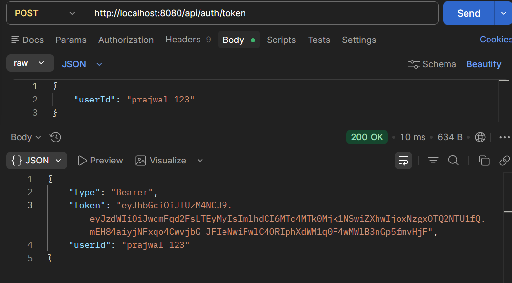
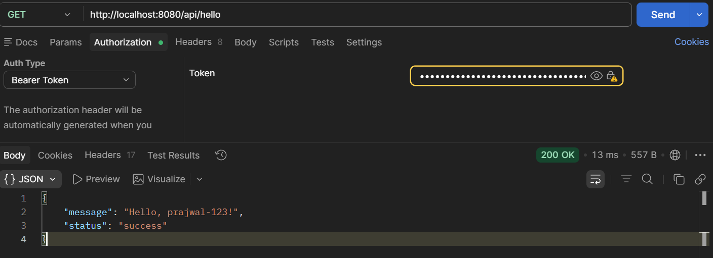
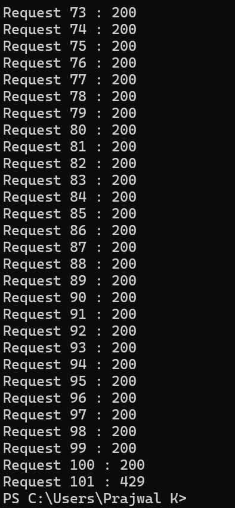
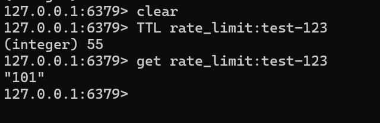

# Superfans Rate Limiter

A Redis-backed, JWT-authenticated rate-limiting gateway built with Spring Boot.

## Overview

This project implements a distributed rate-limiting solution that restricts authenticated users to **100 requests per
minute**. The application uses **JWT authentication** for user identification and **Redis** as a centralized store for
rate-limit counters.

The implementation is designed to be:

* Stateless
* Thread-safe
* Horizontally scalable
* Redis-backed
* Production-oriented
* Easy to extend with more advanced rate-limiting algorithms

---

## Features

* JWT-based authentication
* Per-user rate limiting
* Redis-backed distributed counters
* Atomic counter updates using Redis Lua scripts
* HTTP 429 responses when limits are exceeded
* Standard rate-limit response headers
* Fail-open strategy during Redis outages
* Unit tests
* Concurrency tests
* Stateless Spring Security configuration

---

## Architecture

### Diagram 1: High-Level Architecture

```text
+---------+
| Client  |
+---------+
     |
     | HTTP Request + JWT
     v
+-------------------------+
| JwtAuthenticationFilter |
+-------------------------+
     |
     | Authenticated User
     v
+------------------+
| RateLimitFilter  |
+------------------+
     |
     | check(userId)
     v
+------------------------+
| RedisRateLimitService  |
+------------------------+
     |
     | Lua Script
     v
+---------+
| Redis   |
+---------+
     |
     | Allowed?
     |
+----+----+
|         |
YES       NO
|         |
v         v
+------+  +------------------+
| API  |  | HTTP 429         |
| Ctrl |  | Too Many Requests|
+------+  +------------------+
```

### Request Flow

1. Client sends a request with a JWT Bearer token.
2. `JwtAuthenticationFilter` validates the token.
3. User identity is extracted from JWT claims.
4. `RateLimitFilter` invokes the rate-limiting service.
5. `RedisRateLimitService` checks the current request count.
6. If the user exceeds the limit:

    * HTTP 429 (Too Many Requests) is returned.
7. Otherwise:

    * The request proceeds to the controller.

---

### Diagram 2: Horizontal Scalability

```text
                +---------------+
                | Load Balancer |
                +---------------+
                        |
      ---------------------------------------
      |                 |                   |
      v                 v                   v

 +------------+   +------------+   +------------+
 | Spring App |   | Spring App |   | Spring App |
 | Instance A |   | Instance B |   | Instance C |
 +------------+   +------------+   +------------+
       \                 |                /
        \                |               /
         \               |              /
          \              |             /
           v             v            v
   all instances share Redis as a centralized store
                  +-------------+
                  |    Redis    |
                  +-------------+
               shared Rate Limit State

```

## Technology Stack

* Java 17
* Spring Boot 3
* Spring Security
* Redis
* Redis Lua Scripts
* JUnit 5
* Mockito
* Maven

---

## Authentication

Authentication is performed using JWT Bearer tokens.

### Generate Token

```http
POST /api/auth/token
```

Request:

```json
{
  "userId": "test-123"
}
```

Response:

```json
{
  "token": "<jwt>",
  "userId": "test-123",
  "type": "Bearer"
}
```

### Access Protected Endpoint

```http
GET /api/hello
Authorization: Bearer <token>
```

---

## Rate Limiting Algorithm

### Fixed Window Counter

This implementation uses the **Fixed Window Counter** algorithm.

For each authenticated user:

1. A Redis key is created:

```text
rate_limit:<userId>
```

2. The key is incremented for every request.
3. A TTL equal to the configured window duration is assigned.
4. Once the TTL expires, the counter is automatically removed.
5. A new window starts with a fresh counter.

### Example

Configured limit:

```text
100 requests per minute
```

User requests:

```text
Request #1   -> Allowed
Request #50  -> Allowed
Request #100 -> Allowed
Request #101 -> Blocked (429)
```

---

## Why Fixed Window?

The assignment requires enforcing a fixed request quota per minute.

Fixed Window was selected because it is:

* Simple
* Efficient
* Easy to reason about
* Easy to test
* Well suited to Redis atomic operations

### Known Limitation

Fixed Window allows burst traffic near window boundaries.

Example:

```text
100 requests at 12:00:59
100 requests at 12:01:01
```

Result:

```text
200 requests within approximately 2 seconds
```

while still complying with the configured rate limit.

### Future Improvements

For stricter traffic shaping:

* Sliding Window
* Token Bucket
* Leaky Bucket

could be implemented.

---

## Why Redis?

Redis was chosen because:

* Extremely low latency
* In-memory storage
* Atomic operations
* Shared across multiple application instances
* Well suited for distributed rate limiting

### Why Not Local Memory?

Using a local `HashMap` would only work in a single JVM instance.

When multiple application instances are deployed:

```text
Instance A
Instance B
Instance C
```

each instance would maintain its own counters, resulting in inconsistent rate limiting.

Redis provides a centralized source of truth.

---

## Atomicity and Thread Safety

### Problem

Using separate Redis commands:

```text
INCR
EXPIRE
```

creates a race condition.

Example:

```text
Thread A -> INCR
Thread B -> INCR
Thread A -> EXPIRE
Thread B -> EXPIRE
```

The operations are not executed atomically as a unit.

### Solution

A Redis Lua script performs:

```text
INCR
EXPIRE (if first request)
```

inside a single atomic operation.

Redis guarantees that Lua scripts execute atomically. No other command can interleave while the script is running.

This eliminates TOCTOU (Time Of Check To Time Of Use) race conditions.

---

## Rate Limit Response Headers

Successful responses include:

```http
X-RateLimit-Limit: 100
X-RateLimit-Remaining: 42
X-RateLimit-Reset: 51
```

Rate-limited responses additionally include:

```http
Retry-After: 51
```

These headers allow API consumers to understand:

* Current quota
* Remaining quota
* Time until reset

---

## Redis Outage Handling

### Fail-Open Strategy

If Redis becomes unavailable due to:

* Connection failure
* Timeout
* Network issue

the service allows requests rather than denying all traffic.

```text
Redis Down
      |
      v
Allow Request
```

### Why?

The rate limiter should not become a single point of failure.

A fail-open strategy prioritizes application availability over strict rate-limit enforcement.

Redis failures are logged and can be monitored through metrics and alerting systems.

### Alternative

Security-sensitive systems may choose a fail-closed strategy:

```text
Redis Down
      |
      v
Block Request
```

This provides stricter enforcement but reduces availability.

---

## Horizontal Scalability

The application is completely stateless.

Authentication state is stored inside JWTs.

Rate-limit state is stored in Redis.

```text
Client
   |
   v
Load Balancer
   |
   +----> Instance A
   |
   +----> Instance B
   |
   +----> Instance C
```

All instances share the same Redis-backed counters.

Rate limiting remains consistent regardless of which instance handles the request.

No sticky sessions are required.

---

## Testing

### Unit Tests

Covered scenarios:

* First request allowed
* Request at exact limit
* Request exceeding limit
* Remaining quota calculation
* Retry-after calculation
* Redis key generation
* User isolation
* Redis outage handling

### Concurrency Tests

Concurrency tests verify:

* Thread safety
* Correct enforcement under concurrent load
* Consistent behavior when many requests arrive simultaneously

Example scenario:

```text
200 concurrent requests
100 allowed
100 blocked
```

Atomicity is guaranteed by Redis Lua script execution.

---

## Configuration

```yaml
rate-limit:
  limit: 100
  window-minutes: 1
```

### Redis Configuration

```yaml
spring:
  data:
    redis:
      host: localhost
      port: 6379
```

---

## Running the Application

### Compile the Application

```bash
mvn clean install
```

### Start Redis

```bash
docker run -p 6379:6379 redis
```

Ignore if redis installed locally and start redis instance locally.

### Run the Application

```bash
mvn spring-boot:run
```

---

## Manual Testing (Use Powershell for quick test)

### Generate Token

```bash
$response = Invoke-RestMethod `
    -Method POST `
    -Uri "http://localhost:8080/api/auth/token" `
    -ContentType "application/json" `
    -Body '{"userId":"alice"}'

$token = $response.token

Write-Host $token
```

### Access Protected Endpoint

```bash
try {
    $response = Invoke-WebRequest `
        -Uri "http://localhost:8080/api/hello" `
        -Headers @{Authorization="Bearer $token"}

    Write-Host "Request: $($response.StatusCode)"
}
catch {
        Write-Host "Request : $($_.Exception.Response.StatusCode.value__)"
}
```

Expected:

```text
Request: 200
```

### Rate Limit Test

```bash
for ($i=1; $i -le 101; $i++) {

    try {
        $response = Invoke-WebRequest `
            -Uri "http://localhost:8080/api/hello" `
            -Headers @{Authorization="Bearer $token"}

        Write-Host "Request $i : $($response.StatusCode)"
    }
    catch {
        Write-Host "Request $i : $($_.Exception.Response.StatusCode.value__)"
    }
}
```

Expected:

```text
Requests 1-100 : 200 
Request 101    : 429 
```

---

## Assumptions

1. JWT authentication is simplified for demonstration purposes.
2. User identities are extracted from JWT subject claims.
3. Redis is available as the centralized counter store.
4. Rate-limit state is temporary and may be lost if Redis restarts.
5. Rate limiting is applied per authenticated user.

---

## Observability

In a production deployment, the following metrics should be exposed:

* `rate_limit_allowed_total`
* `rate_limit_blocked_total`
* `redis_failures_total`
* `rate_limit_execution_time`

Metrics can be collected using:

* Micrometer
* Prometheus
* Grafana

These metrics enable monitoring, alerting, and operational visibility.

---

## Future Improvements

* Sliding Window rate limiting
* Token Bucket algorithm
* Leaky Bucket algorithm
* Per-endpoint limits
* Per-user-tier limits
* Dynamic configuration updates
* Redis Cluster support
* Prometheus and Grafana dashboards
* OpenTelemetry tracing
* API Gateway integration

---

## Screenshots

### Generate JWT Token



### Successful Authenticated Request



### Rate Limit Exceeded (429)



### Redis Keys



---

## Conclusion

This implementation provides a distributed, Redis-backed, JWT-authenticated rate limiter with maintaining thread safety,
scalability, and operational simplicity.

The design intentionally favors simplicity and correctness while documenting known trade-offs and future enhancements
for production environments.
